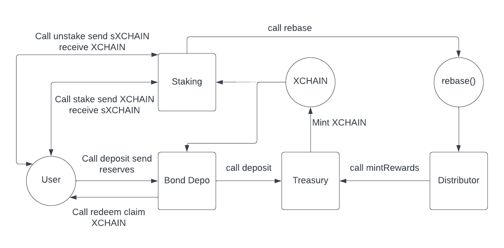

# XCHAIN Smart Contracts

## How it all works

- The main contracts include the Treasury, the Bond Depository, and the Staking.
- The Treasury is where the backing assets are stored, for example USDC or DAI. The Treasury is the protocol’s vault. When backing assets are deposited into the Treasury, XHCAIN is minted.
- The Bond Depository is responsible for depositing backing assets into the Treasury. Bond depositories do not hold any assets as they are immediately transferred to the treasury contract. Users buy bonds by depositing their reserve asset using the Bond Depository. The Bond Depository deposits the money into the Treasury and the Treasury mints XCHAIN for the user. After 5 days, the user can redeem their XCHAIN. Anytime a bond is purchased, a fee (profit) is sent to the owners of the protocol. The Bond Depository is the main way for users to mint and redeem XCHAIN. The only other way is buying on the open market using an exchanhe like QuickSwap.
- The Staking contract is where users can stake their XCHAIN in exchange for sXCHAIN. During every rebase, staking rewards are distributed to holders of sXCHAIN. When user's no longer wish to stake, they can call the unstake method. If the user doesn't have XCHAIN, they won't be able to stake.
- There can be multiple reserve assets. To add another reserve asset, simply deploy a BondDepository contract for the new asset, initialize the bond terms, add the BondDepository address to the treasury, and add the staking address to the BondDepository (view examples in the scripts folder). At any point, the bond terms can be adjusted.

## Mainnet Contracts & Addresses

Coming Soon...

### Mumbai Testnet Addresses

To get test Matic, go to this faucet: https://faucet.polygon.technology/

Network: `Mumbai Polygon Testnet` (8001)
- XCHAIN: `0xd3d2d5F7582b53F0929D06fB6f12473811ba2aB5`
- sXCHAIN: `0xBB3A0712AA17cE116358d71F6C07EB4505D7910a` 
- USDC: `0x9a7E7639322643d02F8CB478baB0EB1019F82389` 
- Treasury: `0x08BC282d0970b19c7E86E6fa35693e321F9E5B50`
- USDCBondDepository: `0x95e9BA3E289888ACd402c3c7b88B2356592b0C59`
- Bonding Calculator: `0x341A25F58F705D51aD52980256357A42F8c0c0B9` 
- Redeem Helper: `0x322c3623d4A30f6334ee876702Da00eE96A6Dc60`
- Staking: `0x033976e7f7c4FEfa3310Ff29DBe46Fc41329a62A` 
- Staking Warmup `0x8173E91c61bc4c54EBa520530452B1D7Aef1d9d7` 
- Staking Helper `0xE594ed5a5A8f17f4d219Cd7214B889968E229506`
- Distributor `0x162A6D2Fa58116da9f692FDf5229EaE39dcBBC1d` 

##  Setting up Local Development
Required: 
- [Node v14](https://nodejs.org/download/release/latest-v14.x/)  
- [Git](https://git-scm.com/downloads)

Local Setup Steps:
1. git clone https://github.com/breakchain/breakchain-protocol-contracts.git
1. Install dependencies: `npm install` 
    - Installs [Hardhat](https://hardhat.org/getting-started/) & [OpenZepplin](https://docs.openzeppelin.com/contracts/4.x/) dependencies
1. Install hardhat-deploy: `npm install -D hardhat-deploy`

##  Deploying smart contracts

1. Anytime you run the deployment script, the folders `artifacts` and `deployments` will be created. You can delete these before your first time deploying to avoid errors.
1. The file hardhat.config.js contains deployment settings. When you run the deployment command, you'll be referencing this values.
1. To deploy, run this command in the terminal `npx hardhat --network ftmTestnet deploy`. Be sure that the crypto wallet in the config has enough to cover gas fees.
1. After deployment is complete, go to the "scripts" folder. Run step_1.js, step_2.js, step_3.js and so on until you've run all 11 steps. Follow this example command `npx hardhat run step_1.js --network ftmTestnet` and replace `step_1.js` with the other script names as you deploy one at a time.
1. Once all scripts are deployed, go to the Tresury contract and call the deposit function using your intended reserve asset. This will provide the Treasury with initial reserves and give you XCHAIN.
1. Now that the Treasury is funded, you can stake, unstake, bond, and redeem.

